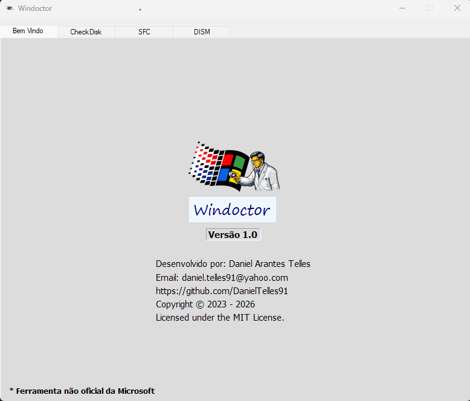
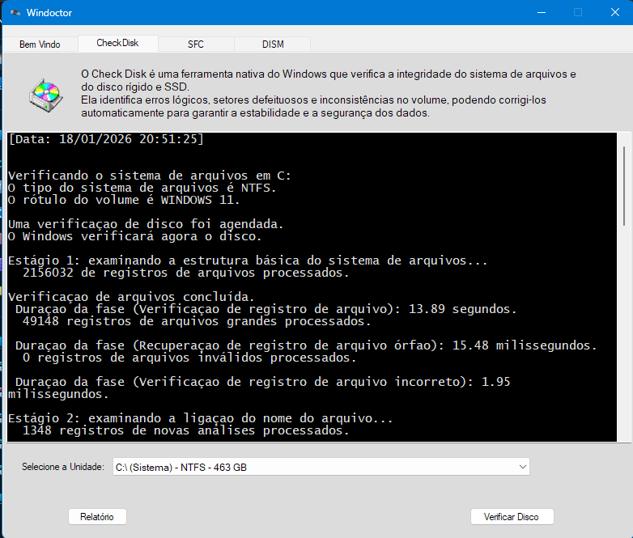
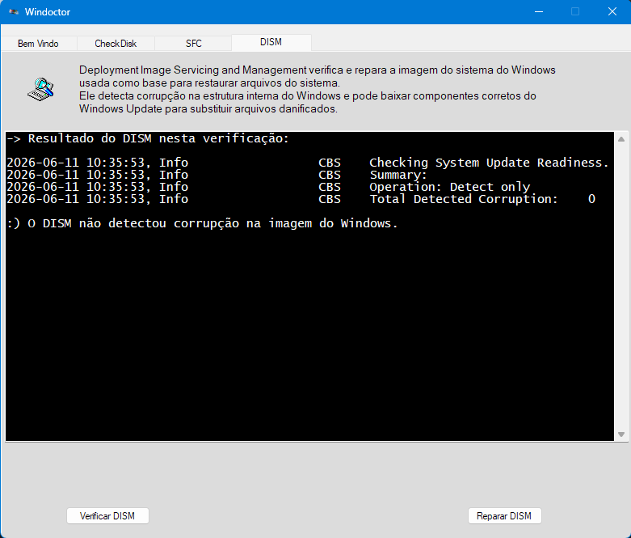

## Windows Maintenance Tool

As a child, I always wondered how Windows applications were built.
This project is a practical answer to that question.

## Overview

Windows Maintenance Tool is a desktop application built with C# and WinForms, designed to simplify essential Windows maintenance tasks while exposing diagnostic information that is usually hidden from end users.
The goal of this project is not only automation, but transparency — allowing users to clearly see what the system is doing, what was found, and what was fixed.

## Features

- Run SFC (System File Checker) with administrator privileges
- Execute DISM health checks and repairs
- Parse and display CBS.log results in a readable format
- Schedule CHKDSK to run at the next system boot
- Read and display the last disk check report after reboot
- Expose system maintenance information normally hidden by Windows
- Visual and audio feedback inspired by classic Windows (95/98 era)

## Screenshot

  
  
  

## Demo Video

## Technologies Used

- C#
- .NET (WinForms)
- Windows system utilities (SFC, DISM, CHKDSK)
- Log parsing and process execution with elevated privileges

## Purpose

This project was created to:

- Simplify common Windows maintenance and diagnostic tasks
- Provide clear feedback instead of silent background operations
- Make system health information accessible and understandable
- Explore native Windows development using WinForms and C#
- Combine classic UX concepts with modern Windows environments

## Development Status

This project is still in development.
It is not production-ready yet and should be used for testing or learning purposes only.

## Author

Developed by Daniel Arantes Telles

## License

This project is licensed under the MIT License - see the LICENSE file for details.

## Notes

This is a personal project developed as part of my technical portfolio.
It reflects my interest in operating systems, diagnostics, system internals, and user-focused tooling.
